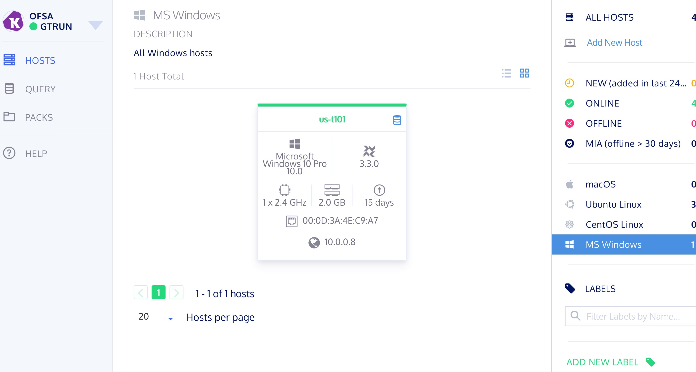

# Table of Contents

1.  [Debian Installation](#org7144977)
    1.  [What is Osqueryi and Osqueryd](#orgabc50d9)
2.  [Easy ways to read](#org3e31d6a)
    1.  [Shell commands](#org8adaed5)
    2.  [Filter](#org9f680c0)
    3.  [OSquery clinet](#orgb7618f6)
        1.  [AustinC/os-browser: Look around your operating system](#org570123f)
    4.  [Syslog collection for OS X & Linux.](#orgd304867)
        1.  [Apple System Log](#org48e7323)
        2.  [linux System log](#orgb3b34ee)
3.  [Extendibility](#org6d493f3)
    1.  [fleet](#orgc704445)
        1.  [installation & configuration](#org2aa6b09)
        2.  [Deployment - Building and Deploying Osquery](#orgdaf45b1)
        3.  [installation lanuacher](#org4f5ec91)
    2.  [Bro-Osquery](#orgd097524)
4.  [reference](#orgbfb6377)

# Debian Installation

    cd ~/src
    wget https://pkg.osquery.io/deb/osquery_3.3.0_1.linux.amd64.deb
    #check SHA Num
    shasum -a 256 osquery_3.3.0_1.linux.amd64.deb
    sudo dpkg -i osquery_3.3.0_1.linux.amd64.deb

## What is Osqueryi and Osqueryd

# Easy ways to read

## Shell commands

    osquery> select * from <key>
    
    osquery> .mode line #
    osquery> .mode pretty

`json format`

    sudo osqueryi select * from <key>;' --json 

## Filter

[osquery For Security – Chris Long – Medium](https://medium.com/@clong/osquery-for-security-b66fffdf2daf)  if you want to get more information about basic control ways, Plz flollwing this link. 
Plus, I only show some operators to filter data via osqueryi

<table border="2" cellspacing="0" cellpadding="6" rules="groups" frame="hsides">

<colgroup>
<col  class="org-left" />

<col  class="org-left" />
</colgroup>
<tbody>
<tr>
<td class="org-left"><del>-------</del>--&#x2013;&#x2014;+</td>
<td class="org-left">&#xa0;</td>
</tr>

<tr>
<td class="org-left"><></td>
<td class="org-left">NOt equal</td>
</tr>

<tr>
<td class="org-left"><</td>
<td class="org-left">less than</td>
</tr>

<tr>
<td class="org-left"><=</td>
<td class="org-left">less than equal</td>
</tr>

<tr>
<td class="org-left">></td>
<td class="org-left">greater than</td>
</tr>

<tr>
<td class="org-left">>=</td>
<td class="org-left">greater than or equal</td>
</tr>
</tbody>
</table>

Example command:

    SELECT username,shell FROM users WHERE shell <> ' /usr/bin/false';

## OSquery clinet

### [AustinC/os-browser: Look around your operating system](https://github.com/AustinC/os-browser)

## Syslog collection for OS X & Linux.

### Apple System Log

These ASL files contain a variety of information that can be of use to ASL of schema from osquery such as the following:

-   Firewall
-   Login Information
-   Program Errors
-   Graphics Errors
-   Network Data
-   Installation Data
-   System Boot, Reboot & Shutdown
-   Privilege Escalation

**Levels of Logging**

That can be found <https://opensource.apple.com/source/Libc/Libc-583/include/asl.h>

/\*! @defineblock Log Message Priority Levels

-   Log levels of the message.

 \*/
\#define ASLLEVELEMERG   0
\#define ASLLEVELALERT   1
\#define ASLLEVELCRIT    2
\#define ASLLEVELERR     3
\#define ASLLEVELWARNING 4
\#define ASLLEVELNOTICE  5
\#define ASLLEVELINFO    6
\#define ASLLEVELDEBUG   7
*\*! @/defineblock \**

`Log data structure for Message Attributes` As defined by asl.h that can be found *asl.h*. But in this section, we only focus one part of keywords which are published Osquery Doc. ([osquery | Schema](https://www.osquery.io/schema/3.3.0#asl))

**ASL in High seria \* Majav**

thoes logs was sotored in /private/var/log/asl that are written in plaintext format.
The filenames follow the format YYYY.MM.DD.[UID].[GID].asl where UID and GID are optional. The date in the filename reflects the date of the contents of the log. The files with the specified User and Group IDs are access controlled to those IDs
To view the file, use the syslog command:

`syslog –f /private/var/log/asl/<logs name>`

### TODO linux System log

# Extendibility

## fleet

### installation & configuration

    wget https://github.com/kolide/fleet/releases/download/2.0.0/fleet_2.0.0.zip
    sudo cp fleet/linux/fleet /usr/bin/fleet
    sudo cp fleet/linux/fleetctl /usr/bin/fleetctl
    sudo apt-get install mysql-server -y && mysql_secure_installation -y
    sudo apt-get install python3-mysqldb python3-pip -y
    sudo apt-get install redis-server -y

when finishing the Mysql-server that you need put `ps aux | grep mysqld` & `ps aux | grep redis`  in command line, and ensure mysqld server should be running.
`set password for root mysql`
sudo mysqlsecureinstallation
service mysqld restart

    mysql    32538  0.2  0.6 686092 74248 ?        Ssl  00:06   0:00 /usr/sbin/mysqld
    ##databse
    mysql -p
    'CREATE DATABASE kolide;
    grant all privileges on kolide.* to 'kolideuser'@'localhost' identified by "hardenedlinux!"’;

if you first time installing mysql that you should be change password for user by `SU` root 

-   Enable certbot

          sudo apt-get install certbot -y
          # cert config
          sudo certbot certonly
          # typically chose 1 option 
          # How would you like to authenticate with the ACME CA?
          # -------------------------------------------------------------------------------
          # 1: Place files in webroot directory (webroot)
          # 2: Spin up a temporary webserver (standalone)
          # -------------------------------------------------------------------------------
          # Select the appropriate number [1-2] then [enter] (press 'c' to cancel): 1
          # -------------------------------------------------------------------------------
          # Select the appropriate number [1-2] then [enter] (press 'c' to cancel): 1
          # Please enter in your domain name(s) (comma and/or space separated)  (Enter 'c'
          # to cancel):nsm-feel.hardenedlinux.com
    
    ##other way Self-Signed -
    openssl req -new -newkey rsa:4096 -x509 -sha256 -days 365 -nodes -out MyCertificate.crt -keyout MyKey.key

-   Loaded database config file.

`sudo fleet serve  --config kolid/database.yml`

-   add a value for &#x2013;authjwtkey

    openssl rand -base64 32
    ## Example Output
    vd24hJTF9kl5/EhvkMSCgPclRJLxqUq27nO84IrombI=

-   Running fleet with systemd *modify database.yaml options which are you wannt change*

    sudo mv fleet.service /etc/systemd/system/fleet.service
    sudo systemctl start fleet.service
    sudo systemctl status fleet.service
    
    sudo journalctl -u fleet.service -f
    
    ##Then, run
    
    sudo systemctl daemon-reload
    sudo systemctl restart fleet.service

### Deployment - Building and Deploying Osquery

1.  windows

        #Open up PowerShell session - 
        git clone https://github.com/facebook/osquery.git
        Prep dev env - 
        .\tools\make-win64-dev-env.bat
        
        
        Open up new PowerShell session - 
        
        Prep build env - 
        .\tools\make-win64-binaries.bat
        
        Prep Config files -
        Get deployment secret from Fleet UI
        PS: notepad osquery.secret (past deployment secret)
        PS: notepad osquery.flags (paste flags, edit hostname)

### TODO installation lanuacher

    mkdir -p $GOPATH/src/github.com/kolide
    cd $GOPATH/src/github.com/kolide
    git clone git@github.com:kolide/launcher.git
    cd launcher

## Bro-Osquery

# reference

-   [Maerz-BroandOsquery-EnterpriseVisibility.pdf](https://www.fbcinc.com/e/nlit/presentations/Maerz-Bro_and_Osquery-Enterprise_Visibility.pdf)
-   [osquery Integration](https://www.bro.org/development/projects/osquery.html)
-   [Bro-Osquery](https://svs.informatik.uni-hamburg.de/publications/2018/2018-05-31-Haas-QueryCon-Bro-Osquery.pdf)
-   [Prajal Kulkarni | Web Security: Attack Monitoring Using ELK #outofband #ELK #osquery #filebeat #ElasticSearch](http://www.prajalkulkarni.com/2016/05/attack-monitoring-using-elk-outofband.html)

