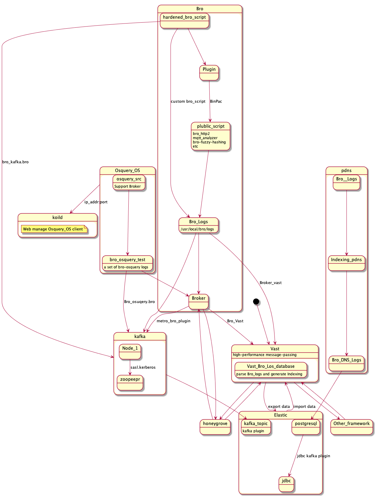

# Table of Contents

1.  [Topology](#org561a0b3)
2.  [ELK materials](#orga6e6c8c)
    1.  [Basic ELKSystem installation](#org257d396)
        1.  [[Doc] Debian-GNU-Linux-Profiles/ELKwithbroIDdoc.mkd at master · hardenedlinux/Debian-GNU-Linux-Profiles](#org8a629f6)
        2.  [[Install] Debian-GNU-Linux-Profiles/ELKINSTALL.sh at master · hardenedlinux/Debian-GNU-Linux-Profiles](#orgd15dd10)
        3.  [[Conf] Debian-GNU-Linux-Profiles/NSM/ELK/conf at master · hardenedlinux/Debian-GNU-Linux-Profiles](#orgb095e29)
        4.  [[plugin] Debian-GNU-Linux-Profiles/NSM/ELK/plugin at master · hardenedlinux/Debian-GNU-Linux-Profiles](#org2dd4d8e)
    2.  [Bro-script Repo](#org5081011)
        1.  [hardenedlinux/hardenedlinux-bro-script](#org07e974f)
    3.  [Bro-Components](#org00c8c02)
        1.  [Bro-osquery](#org9f40226)
        2.  [Pdns](#org1840c3b)
        3.  [Debugging-bro-script](#org34b6654)
        4.  [Quickly bro-script-test-environment](#orgb3d0b09)
    4.  [Osquery-koild](#orgb3a5b73)
        1.  [Debian-GNU-Linux-Profiles/NSM/Osquery at master · hardenedlinux/Debian-GNU-Linux-Profiles](#orgbe74fba)
    5.  [Snort & suricata & Clamav](#org2f74597)
        1.  [[Install] Debian-GNU-Linux-Profiles/SensorINSTALL.sh at master · hardenedlinux/Debian-GNU-Linux-Profiles](#org1538867)
        2.  [[Doc]  Debian-GNU-Linux-Profiles/checklist.org at master · hardenedlinux/Debian-GNU-Linux-Profiles](#org1dd9957)
        3.  [[Demo-rules] Debian-GNU-Linux-Profiles/NSM/sensor/suricata/rules at master · hardenedlinux/Debian-GNU-Linux-Profiles](#org610c1f6)
    6.  [Silk](#org07673b2)
        1.  [[Doc] Debian-GNU-Linux-Profiles/SilkBasic.org at master · hardenedlinux/Debian-GNU-Linux-Profiles](#org75f2269)
        2.  [[Install] Debian-GNU-Linux-Profiles/SilkINSTALL.sh at master · hardenedlinux/Debian-GNU-Linux-Profiles](#org43323d3)
    7.  [Vast](#org3f81081)
        1.  [[Ref] VAST - Home](#orged4ae17)
        2.  [[Install] Debian-GNU-Linux-Profiles/vast.sh at master · hardenedlinux/Debian-GNU-Linux-Profiles](#orgc0c81ba)

# Topology

# ELK materials

Alice -> Bob: Authentication Request
Bob &#x2013;> Alice: Authentication Response

## Basic ELKSystem installation

### [Doc] [Debian-GNU-Linux-Profiles/ELKwithbroIDdoc.mkd at master · hardenedlinux/Debian-GNU-Linux-Profiles](https://github.com/hardenedlinux/Debian-GNU-Linux-Profiles/blob/master/NSM/docs/ELK_with_bro_ID_doc.mkd)

### [Install] [Debian-GNU-Linux-Profiles/ELKINSTALL.sh at master · hardenedlinux/Debian-GNU-Linux-Profiles](https://github.com/hardenedlinux/Debian-GNU-Linux-Profiles/blob/master/NSM/ELK_INSTALL.sh)

### [Conf] [Debian-GNU-Linux-Profiles/NSM/ELK/conf at master · hardenedlinux/Debian-GNU-Linux-Profiles](https://github.com/hardenedlinux/Debian-GNU-Linux-Profiles/tree/master/NSM/ELK/conf)

### [plugin] [Debian-GNU-Linux-Profiles/NSM/ELK/plugin at master · hardenedlinux/Debian-GNU-Linux-Profiles](https://github.com/hardenedlinux/Debian-GNU-Linux-Profiles/tree/master/NSM/ELK/plugin)

## Bro-script Repo

### [hardenedlinux/hardenedlinux-bro-script](https://github.com/hardenedlinux/hardenedlinux-bro-script)

## Bro-Components

### Bro-osquery

1.  [Install] [Debian-GNU-Linux-Profiles/bro-osquery.sh at master · hardenedlinux/Debian-GNU-Linux-Profiles](https://github.com/hardenedlinux/Debian-GNU-Linux-Profiles/blob/master/NSM/Osquery/bro-osquery.sh)

### Pdns

1.  [Install] [Debian-GNU-Linux-Profiles/bro-pkg&pdns.sh at master · hardenedlinux/Debian-GNU-Linux-Profiles](https://github.com/hardenedlinux/Debian-GNU-Linux-Profiles/blob/master/NSM/sensor/bro/bro-pkg%2526pdns.sh)

### Debugging-bro-script

1.  [Doc] [Debian-GNU-Linux-Profiles/bro-debug.org at master · hardenedlinux/Debian-GNU-Linux-Profiles](https://github.com/hardenedlinux/Debian-GNU-Linux-Profiles/blob/master/NSM/sensor/bro/bro-debug.org)

### Quickly bro-script-test-environment

1.  [Doc] [Debian-GNU-Linux-Profiles/broscript.md at master · hardenedlinux/Debian-GNU-Linux-Profiles](https://github.com/hardenedlinux/Debian-GNU-Linux-Profiles/blob/master/NSM/sensor/bro/bro_script.md)

## Osquery-koild

### [Debian-GNU-Linux-Profiles/NSM/Osquery at master · hardenedlinux/Debian-GNU-Linux-Profiles](https://github.com/hardenedlinux/Debian-GNU-Linux-Profiles/tree/master/NSM/Osquery)

## Snort & suricata & Clamav

### [Install] [Debian-GNU-Linux-Profiles/SensorINSTALL.sh at master · hardenedlinux/Debian-GNU-Linux-Profiles](https://github.com/hardenedlinux/Debian-GNU-Linux-Profiles/blob/master/NSM/sensor/Sensor_INSTALL.sh)

### [Doc] [ Debian-GNU-Linux-Profiles/checklist.org at master · hardenedlinux/Debian-GNU-Linux-Profiles](https://github.com/hardenedlinux/Debian-GNU-Linux-Profiles/blob/master/NSM/sensor/suricata/check_list.org)

### [Demo-rules] [Debian-GNU-Linux-Profiles/NSM/sensor/suricata/rules at master · hardenedlinux/Debian-GNU-Linux-Profiles](https://github.com/hardenedlinux/Debian-GNU-Linux-Profiles/tree/master/NSM/sensor/suricata/rules)

## Silk

### [Doc] [Debian-GNU-Linux-Profiles/SilkBasic.org at master · hardenedlinux/Debian-GNU-Linux-Profiles](https://github.com/hardenedlinux/Debian-GNU-Linux-Profiles/blob/master/NSM/silk/SilkBasic.org)

### [Install] [Debian-GNU-Linux-Profiles/SilkINSTALL.sh at master · hardenedlinux/Debian-GNU-Linux-Profiles](https://github.com/hardenedlinux/Debian-GNU-Linux-Profiles/blob/master/NSM/silk/Silk_INSTALL.sh)

## Vast

### [Ref] [VAST - Home](http://vast.io/)

### [Install] [Debian-GNU-Linux-Profiles/vast.sh at master · hardenedlinux/Debian-GNU-Linux-Profiles](https://github.com/hardenedlinux/Debian-GNU-Linux-Profiles/blob/master/NSM/sensor/bro/vast.sh)

