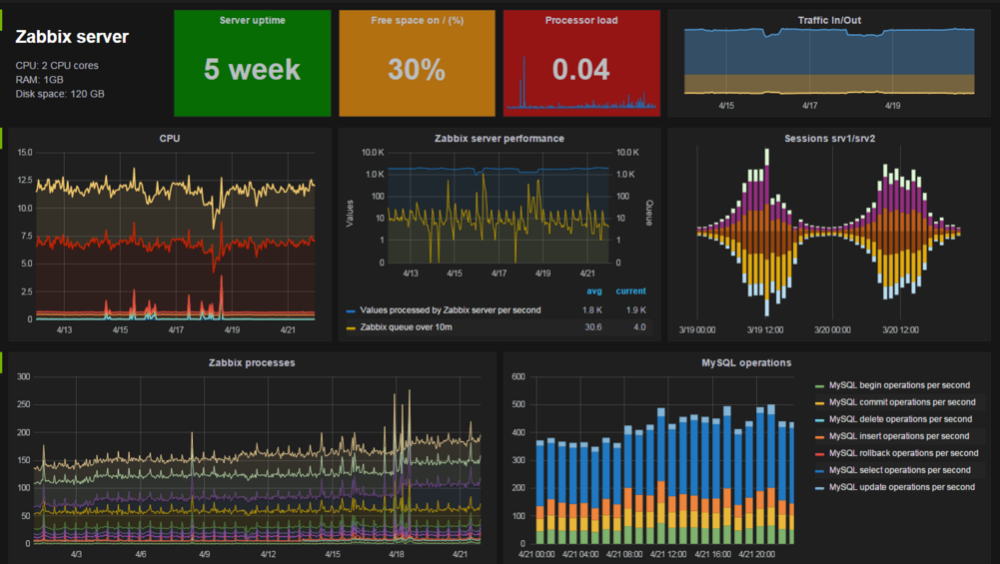

# How to build a small SOC for your Cyberspace Security

- [Overview](#overview)
- [SOC平台架构](#soc平台架构)
- [小型SOC构建](#小型soc构建)
  - [简约版SOC](#简约版soc)
  - [数据采集](#数据采集)
    - [采集方式](#采集方式)
    - [网络流量](#网络流量)
    - [主机数据](#主机数据)
    - [移动设备数据](#移动设备数据)
    - [日志数据](#日志数据)
    - [设备告警数据](#设备告警数据)
    - [威胁情报](#威胁情报)
  - [数据处理](#数据处理)
    - [数据标准化](#数据标准化)
    - [数据清洗](#数据清洗)
    - [数据索引](#数据索引)
    - [数据计算](#数据计算)
    - [关联分析](#关联分析)
      - [规则关联](#规则关联)
    - [行为分析](#行为分析)
  - [安全展示](#安全展示)
    - [Kibana](#kibana)
    - [Grafana](#grafana)
    - [other APPs](#other-apps)
- [安全分析场景](#安全分析场景)
  - [场景一](#场景一)
  - [场景二](#场景二)
  - [场景三](#场景三)
- [补充](#补充)
  - [- 设想](#--设想)
  - [- 注解](#--注解)

# Overview

SOC(Security Operation Center). 
安全是一个动态的过程，随着攻击者的手段不断变化，攻击方法和工具也在不断更新和出现，同时随着业务的发展，组织中的网络发生变化，资产也在不断增多，需要保护的对像也在发生变化。因此需要对提供对组织的网络空间进行持续的运营、维护和优化，因此SOC应运而生。
安全运营中心业界通常称为SOC（Security Operations Center），SOC采用集中管理方式，统一管理相关安全产品，搜集所有网内资产的安全信息，并通过对收集到的各种安全事件进行深层的分析、统计、和关联，及时反映被管理资产的安全情况，定位安全风险，对各类安全事件及时发现和定位，并及时提供处理方法和建议，协助管理员进行事件分析、风险分析、预警管理和应急响应处理。
SOC平台能够对各种多源异构数据源产生的信息进行收集、过滤、格式化、 归并、存储，并提供了诸如关联分析、行为分析、风险分析、异常检测等能力，使用户对整个网络的运行状态进行实时监控和管理，对各种资产进行脆弱性评估，对各种安全事件进行分析、统计和关联，并及时发布预警，提供快速响应能力。

# SOC平台架构

下图为SOC平台的架构：

从上图，可以看出SOC平台的架构分为4层：数据采集、数据处理、安全分析和安全管理，通过对主机、数据库、应用系统、网络设备、安全设备及网络流量进行采集，加上组织中的资产、人员等数据，结合通过商业或开源情报的威胁情报信息进行持续的安全分析和运营。

-   数据采集:
    -   日志数据采集引擎
    -   流量数据采集引擎
    -   资产信息采集引擎
    -   配置信息采集引擎
    -   威胁情报采集引擎
    -   情境数据采集引擎

-   数据处理:
    -   消息订阅
    -   消息分发
    -   数据范化
    -   数据增强
    -   数据过滤
    -   数据归并
    -   数据索引
    -   数据治理
    -   数据服务接口

-   安全分析:
    -   计算分析引擎
        -  关联引擎
        -  行为分析引擎
        -  交互分析引擎
        -  流式计算引擎
        -  批式计算引擎
        -  机器学习/AI
    -   资产分析
    -   日志分析
    -   漏洞分析
    -   威胁分析
    -   风险分析
    -   评估预测

-   安全管理:
    -   态势呈现
    -   安全监测
    -   调查分析
    -   告警管理
    -   安全处置
    -   指挥管理

# 小型SOC构建
从上图看出，SOC平台是一个很大的平台，要想建设好，需要一个长时间的过程和投入，还需要各部门的配合。可以先通过对最基础的单元建设，使其具有一定的安全分析能力。本文是通过建设一个小型的SOC，来如何保障组织的安全运营与管理。

## 简约版SOC
下图是简化后的SOC结构。

从此图可以看出，此SOC在数据收集上，针对网络流量、主机、移动设备、日志进行采集，通过威胁平台接口来获取威胁情报数据，使得更易落地，利用开源的软件、数据和系统来完成一个SOC的快速实现。

针对简化版的SOC，进行分层介绍：

## 数据采集

全面收集所服务范围内的海量安全信息，统一采集后交由数据服务层处理。

### 采集方式
本案例中的数据采集涉及到如下几种采集方式(后续针对每种不同的数据进行细节性介绍)。

| 序号 | 目标   | 采集程序   | 采集方式 | 数据类型     |
| ---- | -------- | -------------- | -------- | ---------------- |
| 1    | 网络流量 | Zeek           | 流量镜像 | Network Metadata |
| 2    | 网络流量 | Snort/Suricata | 流量镜像 | Alert Data       |
| 3    | 主机   | OSquery        | 主机安装 | Linux主机数据 |
| 4    | 主机   | SYSMON         | 主机安装 | Windows主机数据 |
| 5    | 移动设备 | Agent       | SYSLOG | 移动设备日志和报警日志  |
| 6    | 设备日志 | Logstash       | SYSLOG/SNMPTrap | 设备运行和告警日志  |
| 7    | 应用日志 | FileBeat       | 主机安装 | 应用的日志         |
| 8    | 威胁情报   | 威胁情报平台         | API | 威胁情报数据 |

注：常见的采集方式还有FTP方式、Webservice等方式。

### 网络流量
在网络流量数据中，此项目中通过对交换机进行流量镜像的方式，使用Zeek(Bro)进行Network Metadata采集和部分安全数据提取，使用Snort/Suricata进行网络IDS检测收集网络攻击告警数据。
- Zeek 采集的数据内容如下(包括但不限于)：

| 序号 | 日志类型        | 协议             | 数据内容                                                                                                                                                                                      |
|----|-------------|----------------|-------------------------------------------------------------------------------------------------------------------------------------------------------------------------------------------|
| 1  | HTTP会话记录    | HTTP           | 五元组，method 请求模式，host 主机，uri， referrer 来源，user\_agent ua标识，request\_body\_len 请求体长度 response\_body\_len响应体长度，status\_code 响应状态吗，username/password  401认证用户名与密码，orig\_mime\_types  MIME类型 ， |
| 2  | 网络会话记录      | TCP/IP         | 对应着netflow信息，将五元组（源ip、源端口、目标ip、目标端口、协议）相同的会话创建一个记录，tcp流量会根据正常挥手或rst来结束记录udp/icmp则是根据超时来结束记录                                                                                               |
| 3  | DNS请求响应记录   | DNS            | 记录五元组与dns请求域名、请求类型、解析结果等，日志中应重点关注一些dns txt记录/超长请求域名/心跳包请求检测。                                                                                                                              |
| 4  | SSL协议解析日志   | SSL            | 五元组信息，SSL版本，加密算法，服务器名称，证书信息，ja3                                                                                                                                                           |
| 5  | SSH登陆记录     | SSH            | 五元组、auth\_success登陆状态、client客户端版本、server服务器版本、cipher 加密算法                                                                                                                                 |
| 6  | mysql协议解析日志 | Mysql          | 五元组、cmd动作、arg执行命令、success是否执行成功、rows列数                                                                                                                                                    |
| 7  | snmp解析日志    | SNMP           | 五元组、SNMP密码                                                                                                                                                                                |
| 8  | rdp连接日志     | RDP            | 五元组、auth\_success登陆状态、client客户端版本、server服务器版本                                                                                                                                             |
| 9  | 邮件日志        | SMTP/POP3/IMAP | 五元组、发送人、接收邮箱、主题及附件、验证密码等                                                                                                                                                                  |
| 10 | FTP日志       | FTP            | 五元组、FTP协议解析、文件名、用户名等                                                                                                                                                                      |
| 11 | telnet日志    | telnet         | 五元组、telnet动作、命令                                                                                                                                                                           |
| 12 | 警告信息        |                | weird\.log  协议错误、notice\.log bro脚本产生的告警                                                                                                                                                   |

- Snort/Suricata采集的数据内容如下：

| 序号 | 日志字段                   | 说明 |
|----|------------------------|----|
| 1  | 产生告警时间                 |    |
| 2  | 攻击特征编号\(Signature ID\) |    |
| 3  | 攻击名称                   |    |
| 4  | 攻击类型                   |    |
| 5  | 告警优先级                  |    |
| 6  | 协议                     |    |
| 7  | 源IP地址                  |    |
| 8  | 源端口                    |    |
| 9  | 目的IP地址                 |    |
| 10 | 目的端口                   |    |

### 主机数据
主机上面主要存在八大类数据。目前主要是通过OSquery(Linux)和SYSMON(WIndows)上面进行采集，需要安装在目标机。
如设备不能安装上述软件，推荐最少采集系统日志(日志策略打开并加固后的)，可采用syslog或evt方式输出。

| 序号 | 内容    | 说明 |
|----|-------|----|
| 1  | 系统服务  |    |
| 2  | 运行进程  |    |
| 3  | 启动程序  |    |
| 4  | 开放端口  |    |
| 5  | 系统帐号  |    |
| 6  | 网络连接  |    |
| 7  | 安装的软件 |    |
| 8  | 文件    |    |

### 移动设备数据
针对移动设备，可通过MTD(Mobile Threat Defense)或MDM(Mobile Device Management)平台中的采集的信息传给此平台，或通过专门的采集Agent安装在移动设备上面采集。

采集的内容包括但不限于以下：

| 序号 | 内容     | 说明                               |
| ---- | -------- | ---------------------------------- |
| 1    | 网络访问 |                                    |
| 2    | 运行进程 |                                    |
| 3    | 安装软件 |                                    |
| 4    | 权限请求 |                                    |
| 5    | APP运行 |APP运行日志           |
| 6    | 文件访问 |                                    |
| 7    | 设备信息 |                                    |
| 8    | 沙箱记录 | 因root权限原因，在沙箱中可以记录更详细更多的信息 |

### 日志数据
针对中间件、应用程序或应用系统，可以采集其运行、配置变更、告警等信息，可关注登录登出、报错、访问请求等数据，在采集方式可由读取日志文件(Filebeat)、读数据库中的记录来进行采集。

### 设备告警数据
针对网络设备、安全设备等设备的采集，可采集其运行、配置变更、登录登出、错误或报警日志，对设备采集的告警进行关注。
常规的网络设备、安全设备可通过SYSLOG或SNMP TRAP方式进行采集，个别设备可通过数据库读取的方式进行采集。

### 威胁情报
通过威胁平台接口来获取威胁情报数据，可以对接威胁情报平台或公开且更新的威胁情报数据，主要涉及下列几类数据：

| 序号 | 内容     | 说明                               |
| ---- | -------- | ---------------------------------- |
| 1    | 恶意软件 | hash、分类 |
| 2    | 恶意网址 | 分类、网址 |
| 3    | 恶意IP地址 | 分类、IP地址 |
| 4    | 恶意域名 | 分类、域名 |
| 5    | 恶意邮件 |分类、关注主题、发送人、发送服务器、发送IP等           |
| 6    | 攻击特征 |                                    |

## 数据处理
上述收集的数据有着不同的结构，系统需要对这些数据进行数据处理，包括海量数据的存储、检索和高性能数据处理，实现数据的标准化，并建立索引方便快速引用。 

-   对采集的数据进行解析、泛化、过滤、归并等预处理工作
-   结合情报数据和支持数据对标准化的信息进行补全
-   将处理的信息通过灵活的数据集成总线进行订阅分发给应用层的安全分析业务提供数据使用

### 数据标准化
数据标准化(又称:范式化)是将不同厂家、不同格式的数据中某些关键信息，利用正则表达式来匹配、提取，然后通过相应的范化文件将提取的信息（或通过范式化文件将数据中缺失的信息）赋值给系统中预先定义好的各字段的过程。
对于所有采集上来的日志，系统对常见的几种类型数据进行了范式化处理，将各种厂商各种类型的日志格式转换成统一的格式。同时系统将收集到的原始日志都原封不动的保存，以备调查取证之用。
经过范式化后的字段包括日志接收时间、日志产生时间、源地址、源MAC地址、源端口、用户名称、操作、目的地址、目的MAC地址、目的端口、日志的名称、摘要、等级、原始等级、原始类型、网络协议、网络应用协议、设备地址、设备名称、设备类型等字段，并可以支持扩展。
根据不同的数据，标准化的同时，还会根据数据不同的类型定义特定的字段内容。
标准化的字段内容包括但不限于如下：
| 序号 |字段名称 | 说明                               |
| ---- | -------- | ---------------------------------- |
|1|事件ID||
|2|采集器IP||
|3|采集方式||
|4|接收时间||
|5|数据分类||
|6|产生时间||
|7|事件名称||
|8|事件描述||
|9|事件分类||
|10|事件等级||
|11|设备编号||
|12|设备IP||
|13|设备类型||
|14|设备名称||
|15|设备厂商||
|16|产品名称||
|17|进程||
|18|原始日志||
|19|帐号名称||
|20|源设备名称||
|21|源IP||
|22|源端口||
|23|源地址转换||
|24|源端口转换||
|25|源MAC||
|26|源域名称||
|27|操作||
|28|目标设备名称||
|29|目标IP||
|30|目标端口||
|31|目的地址转换||
|32|目的端口转换||
|33|目标MAC||
|34|目标域名称||
|35|资源类型||
|36|资源名称||
|37|结果||
|38|动作||
|39|网络协议||
|40|应用协议||
|41|发送流量||
|42|接收流量||
|43|总流量||
|44|持续时间||
|45|原始日志类型||
|46|原始日志等级||

常见的设备日志主要字段内容包括但不限于如下:
| 设备类型   | 事件类型 | 主要字段 |
|--------------|------------------------|--------------------------------|
|防火墙|账户明文远程登录|事件接收时间、账户名、源IP、操作、设备IP、设备名称、结果、应用协议|
|防火墙|防火墙事件|事件接收时间、事件分类、事件等级、设备IP、设备名称、设备厂商、原始日志|
|防火墙|防火墙配置变更事件|事件接收时间、事件分类、账户名、源IP、操作、设备IP、设备名称、资源名称|
|防火墙|网络连接事件|事件接收时间、事件分类、源IP、目标IP、目标端口、网络协议、应用协议、动作、开始时间、结束时间、发送字节数、接收字节数、持续时间|
|防火墙|攻击入侵事件|事件接收时间、事件分类、源IP、目标IP、目标端口、动作、客户端工具、设备IP、设备名称|
|防火墙|设备状态事件|事件接收时间、事件分类、事件等级、设备IP、设备名称、设备厂商、原始日志|
|WAF|WAF事件|事件接收时间、事件名称、事件分类、事件等级、设备IP、设备名称、设备厂商、原始日志|
|WAF|设备状态事件|事件接收时间、事件名称、事件分类、事件等级、设备IP、设备名称、设备厂商、原始日志|
|WAF|WAF配置事件|事件接收时间、事件名称、事件分类、账户名、源IP、操作、结果、设备IP、设备名称|
|WAF|攻击阻断事件|事件接收时间、事件名称、事件分类、事件等级、源IP、目标IP、目标端口、目标域名、URL、动作、应用协议、X-forward-for、应用协议、http方法|
|WAF|攻击放行事件|事件接收时间、事件名称、事件分类、事件等级、源IP、目标IP、目标端口、目标域名、URL、动作、应用协议、X-forward-for、应用协议、http方法|
|IDS/IPS|IDS/IPS事件|事件接收时间、事件名称、事件分类、事件等级、设备类型、设备IP、设备名称、设备厂商|
|IDS/IPS|攻击阻断事件|事件接收时间、事件名称、事件分类、事件等级、源IP、目标IP、目标端口、目标域名、文件路径、动作、应用协议|
|IDS/IPS|攻击放行事件|事件接收时间、事件名称、事件分类、事件等级、源IP、目标IP、目标端口、目标域名、文件路径、动作、应用协议|
|防病毒|防病毒事件|事件接收时间、事件名称、事件分类、事件等级、设备类型、设备IP、设备名称、设备厂商、原始日志|
|防病毒|病毒检测事件|事件接收时间、事件名称、事件分类、事件等级、设备类型、设备IP、源IP、目的IP、路径、病毒名、动作、结果|
|防病毒|特征库升级事件|事件接收时间、设备类型、设备IP、资源名称（升级包）、原始日志|
|网络设备|网络设备故障|事件接收时间、事件分类、事件等级、设备类型、设备IP、设备名称、设备厂商、原始日志|
|网络设备|网络设备认证|事件接收时间、事件分类、事件等级、设备类型、设备IP、设备名称、设备厂商、原始日志|
|网络设备|系统配置事件|事件接收时间、事件分类、事件等级、设备类型、账户名称、源IP、操作、设备IP、设备名称、资源名称|
|网络设备|地址冲突事件|事件接收时间、事件分类、事件等级、事件名称、受影响IP、设备接口、MAC地址、设备类型、设备IP、设备名称|
|Windows|Windows主机所有事件|事件接收时间、事件名称、事件分类、事件等级、设备IP、原始日志|
|Windows|Windows主机新服务事件|事件接收事件、事件名称、事件分类、设备IP、设备名称、资源名称、原始日志|
|Windows|Windows主机平台筛选连接|事件接收事件、事件名称、事件分类、源IP、设备IP、目的IP、目的端口、网络协议、动作|
|Windows|Windows主机创建新进程|事件接收事件、事件名称、事件分类、设备IP、账户名、资源名称（用户启动的进程名）|
|Windows|Windows主机用户账户更改|事件接收事件、事件名称、事件分类、设备IP、设备名称、账户名、操作、资源名称|
|Windows|Windows主机文件与注册表|事件接收事件、事件名称、事件分类、设备IP、设备名称、资源名称、原始日志|
|Windows|Windows主机登录尝试|事件接收时间、事件名称、事件分类、账户名、源IP、源设备名称、源域名称、操作、设备IP、设备名称、结果、登录类型|
|Windows|Windows主机共享访问|事件接收时间、事件名称、事件分类、账户名、源IP、源设备名称、源域名称、设备IP、设备名称、资源名称|
|Linux|Linux事件|事件接收时间、事件分类、事件等级、设备IP、设备名称、进程、原始日志|
|Linux|root账户远程登录|事件接收时间、账户名、源IP、操作、设备IP、设备名称、结果、应用协议|
|Linux|用户账户更改|事件接收事件、设备IP、设备名称、帐号名称、源IP、操作、事件摘要|
|Web事件|Web访问事件|事件接收时间、事件分类、事件等级、应用协议、源IP、操作、指令、目的域名、目的IP、目的端口、URL、资源名称、发送流量、接收流量、客户端工具、状态、Referer|

### 数据清洗
系统可以对采集到的数据根据定义的策略进行过滤、归并、去重等清洗，提升数据的效率，同时也可根据关键字进行新的事件，用于记录告警。

通过过滤操作，可以剔除掉无用的数据和有问题的数据，降低数据噪音。

通过归并操作，可以把短时间内满足一定条件的多条数据合并成一条，减少数据的存储量。

### 数据索引

通过对数据的标准化和清洗后，根据数据类型将整理后的数据落入Elasticsearch中，并建立索引。只有通过索引操作，才能对数据进行分析存储、创建倒排索引，从而可以快速查询到相关的信息。

### 数据计算

在数据处理中，可对已知安全分析场景中所需要计算的数据通过程序来实现并将结果根据需求写入Redis或MariaDB中。

对动态要求频率高的，建议放在Redis中，对只记录数据结果的，建议放在MarriaDB中。例:对网络中访问域名数据进行统计，形成Top N，可将域名、次数、日期等信息放入Redis中快速处理。

在实践中，我们尝试对以下数据进行计算，可以发现一些异常现象：

- 针对Zeek的http记录对WEB服务url建立目录树，并统计访问次数
- 针对Zeek解析的DNS记录此domain第一次出现的时间、最后一次出现的时间、请求次数、解析IP的变化
- 针对Zeek解析的conn进行指定网段的IP范围端口访问统计

### 关联分析

#### 规则关联

系统可对单条事件或多条事件定义规则，进行事件关联分析，识别已知模式的攻击和违规。
- 通过单事件关联，系统可以对符合单一规则的事件流进行规则匹配；
- 通过多事件关联，系统可以对符合多个规则（称作组合规则）的事件流进行复杂事件规则匹配。

以下为关联分析示例说明：
| 逻辑关联 | 来源IP=XX.XX.XX.XX 并且 目标IP=XX.XX.XX.XX 并且 端口=3306 |
| -------- | --------------------------------------------------------- |
| 逻辑关联 | 内网OA服务器连接CC服务器                                  |
| 统计关联 | 同一个IP连续使用不同的帐号登录某台服务器失败，次数大于6次 |
| 统计关联 | 在一台机器上面收到某IP连续登录失败10次后，成功登入        |

### 行为分析

- [ ] 待续

## 安全展示

### Kibana

Kibana是一个针对Elasticsearch的开源分析及可视化平台，用来搜索、查看交互存储在Elasticsearch索引中的数据。使用Kibana，可以通过各种图表进行高级数据分析及展示。
Kibana让海量数据更容易理解。它操作简单，基于浏览器的用户界面可以快速创建仪表板（dashboard）实时显示Elasticsearch查询动态。
分析人员可以通过Kibana自定义查询场景，实现基于事件时间、名称、地址、端口、类型等各种条件的组合查询，支持关键字查询、模糊查询。
下图为通过Kibana界面查看网络访问日志，分析人员可以快速过滤查找他感兴趣的内容。

下图为通过对网络流量识别运行软件的统计示例：

### Grafana

Kibana可以访问快速检索出已入ES的数据，但是对于其他数据库的数据不支持，故此案例中引入了Grafana，可以访问MariaDB中的数据。
Grafana是一个跨平台的开源的度量分析和可视化工具，可以通过将采集的数据查询然后可视化的展示，并及时通知。它主要有以下六大特点：

1. 能够连接多种数据源、ElasticSearch、MySQL、PoastgreSQL、InfluxDB、OpenTSDB、CloudWath、Zabbix等。
2. 基于插件的方式实现数据的可视化图表，饼图、折线图、柱状图、热图等，实现快速灵活的展示，面板插件有许多不同方式的可视化指标和日志；
3. 以可视方式定义最重要指标的警报规则，Grafana将不断计算并发送通知，在数据达到阈值时通过Slack、PagerDuty等获得通知；
4. 在同一图表中混合使用不同的数据源，可以基于每个查询指定数据源，甚至自定义数据源；
5. 使用来自不同数据源的丰富事件注释图表，将鼠标悬停在事件上会显示完整的事件元数据和标记；
6. Ad-hoc过滤器允许动态创建新的键/值过滤器，这些过滤器会自动应用于使用该数据源的所有查询。

### other APPs

当前初步实现了安全数据可视，如需要特定的需求，可定制相应的程序通过数据接口访问数据进行相应的分析和计算。

# 安全分析场景

## 场景一

- 名称:WEB攻击中安全设备告警命中
- 描述:WAF/IDS/IPS在检测WEB攻击时存在大量的误报(当WEB不存在这个文件时，只要有扫描或探测，这些设备还是会告警)，存在着大量的垃圾告警数据，给安全运维人员造成太多的精力浪费，而通过LM的关联分析能力，通过将WEB日志（WebServer的访问日志或流量中抓包的会话数据）与安全设备告警时间进行初次过滤，排除不存在的文件告警，降低需要分析的告警数量。

## 场景二

- 名称:安全设备WEB攻击告警比对

- 描述:

  - 快速验证针对WEB攻击的事件
    安全设备的WEB事件的请求路径与DPI出来的请求路径命中，并且状态码=200/304/401/403/501等，确认此URL存在排除大量的扫描误报，可区别扫描和进行攻击

  - 针对确认的WEB攻击进行二次命中

    对上述命中的事件进行二次分析，识别真实攻击
## 场景三

- 名称:某单位VPN帐号被多人共用违规事件
- 描述:2016年6月2日上午，监控发现VPN账户jia_jun登录次数为39次，频率远远超过正常频率，接着再对历史数据进行查询，发现在同一时间范围内存在有3个地址登录过jia_jun账号，IP来源分布在不同的地县市，根据这种行为判断此VPN帐号存在被盗用或多人共用的可能。经核实，单位员工贾某将其帐号和密码告诉其同事李某、王某，在外接入VPN，违规单位安全规定，属于一起违规事件。

# 补充

## - 设想

- 关联分析-情境关联
  - 可结合资产属性、漏洞、威胁情报、故障进行情境分析
  - 对资产类型、资产标签、相关的漏洞、资产价值、开放的服务端口、所处的应用系统和网络位置进行关联，来判断影响
- 通过对应用系统中某台设备的有问题或被攻击，而对整个系统的影响性判断分析

## - 注解

通过以一个小型网络为监控对像的方式来部署[此系统](https://github.com/hardenedlinux/debian-nix-manager)，可以快速的对网络流量和日志进行采集，能快速展示和分析。