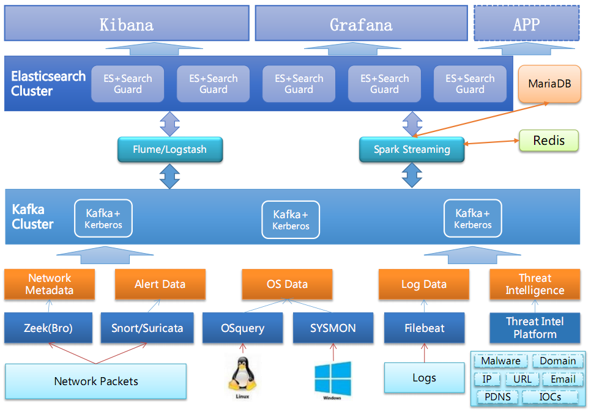

# How to build a small SOC for your Cyberspace Security

1.  [介绍](#orgd951a1b)
2.  [SOC平台架构](#org55b12aa)
3.  [小型SOC构建](#org55b13aa)
    1.  [简约版SOC](#org55b131a)
    2.  [数据采集](#org55b132a)
        1.  [采集方式](#org55b1321)
        2.  [网络流量](#org55b1322)
        3.  [主机数据](#org55b1323)
        4.  [日志数据](#org55b1324)
        5.  [设备告警数据](#org55b135)
        6.  [威胁情报](#org55b1326)
    3.  [数据处理](#org55b133a)
        1.  [数据标准化](#org55b1331)
        2.  [数据清理](#org55b1332)
        3.  [数据索引](#org55b1333)
    4.  [安全分析](#org55b134a)
        1.  [数据关联](#org55b1341)
        2.  [行为分析](#org55b1342)
    5.  [安全展示](#org55b135a)
        1.  [Kibana](#org55b1351)
        2.  [Grafana](#org55b1352)
        3.  [other APPs](#org55b1353)
4.  [安全分析场景](#org55b14aa)
5.  [补充](#org55b15aa)
    1.  [设想](#org55b151a)
    2.  [记录](#org55b152a)

# Overview

    SOC(Security Operation Center).  
    安全是一个动态的过程，随着攻击者的手段不断变化，攻击方法和工具也在不断更新和出现，同时随着业务的发展，组织中的网络发生变化，资产也在不断增多，需要保护的对像也在发生变化。因此需要对提供对组织的网络空间进行持续的运营、维护和优化，因此SOC应运而生。
    安全运营中心业界通常称为SOC（Security Operations Center），SOC采用集中管理方式，统一管理相关安全产品，搜集所有网内资产的安全信息，并通过对收集到的各种安全事件进行深层的分析、统计、和关联，及时反映被管理资产的安全情况，定位安全风险，对各类安全事件及时发现和定位，并及时提供处理方法和建议，协助管理员进行事件分析、风险分析、预警管理和应急响应处理。
    SOC平台能够对各种多源异构数据源产生的信息进行收集、过滤、格式化、 归并、存储，并提供了诸如关联分析、行为分析、风险分析、异常检测等能力，使用户对整个网络的运行状态进行实时监控和管理，对各种资产进行脆弱性评估，对各种安全事件进行分析、统计和关联，并及时发布预警，提供快速响应能力。

## SOC平台架构

下图为SOC平台的架构：

从上图，可以看出SOC平台的架构分为4层：数据采集、数据处理、安全分析和安全管理，通过对主机、数据库、应用系统、网络设备、安全设备及网络流量进行采集，加上组织中的资产、人员等数据，结合通过商业或开源情报的威胁情报信息进行持续的安全分析和运营。

-   数据采集:
    -   日志数据采集引擎
    -   流量数据采集引擎
    -   资产信息采集引擎
    -   配置信息采集引擎
    -   威胁情报采集引擎
    -   情境数据采集引擎

-   数据处理:
    -   消息订阅
    -   消息分发
    -   数据范化
    -   数据增强
    -   数据过滤
    -   数据归并
    -   数据索引
    -   数据治理
    -   数据服务接口

-   安全分析:
    -   计算分析引擎
        -  关联引擎
        -  行为分析引擎
        -  交互分析引擎
        -  流式计算引擎
        -  批式计算引擎
        -  机器学习/AI
    -   资产分析
    -   日志分析
    -   漏洞分析
    -   威胁分析
    -   风险分析
    -   评估预测

-   安全管理:
    -   态势呈现
    -   安全监测
    -   调查分析
    -   告警管理
    -   安全处置
    -   指挥管理

## 小型SOC构建
从上图看出，SOC平台是一个很大的平台，要想建设好，需要一个长时间的过程和投入，还需要各部门的配合。可以先通过对最基础的单元建设，使其具有一定的安全分析能力。本文是通过建设一个小型的SOC，来如何保障组织的安全运营与管理。

## 简约版SOC
下图是简化后的SOC结构。

从此图可以看出，此SOC在数据收集上，针对网络流量、OS、日志进行采集，通过威胁平台接口来获取威胁情报数据，使得更易落地，利用开源的软件、数据和系统来完成一个SOC的快速实现。
针对简化版的SOC，进行分层介绍：

## 数据采集

## 采集方式
本项目中的数据采集涉及到如下几种采集方式(后续针对每种不同的数据进行细节性介绍)。

| 序号 | 目标   | 采集程序   | 采集方式 | 数据类型     |
| ---- | -------- | -------------- | -------- | ---------------- |
| 1    | 网络流量 | Zeek           | 流量镜像 | Network Metadata |
| 2    | 网络流量 | Snort/Suricata | 流量镜像 | Alert Data       |
| 3    | 主机   | OSquery        | 主机安装 | Linux主机数据 |
| 4    | 主机   | SYSMON         | 主机安装 | Windows主机数据 |
| 5    | 设备日志 | Logstash       | SYSLOG/SNMPTrap | 设备运行和告警日志  |
| 6    | 应用日志 | FileBeat       | 主机安装 | 应用的日志         |
| 7    | 威胁情报   | 威胁情报平台         | API | 威胁情报数据 |

注：常见的采集方式还有FTP方式、Webservice等方式。

## 网络流量
在网络流量数据中，此项目中通过对交换机进行流量镜像的方式，使用Zeek(Bro)进行Network Metadata采集和部分安全数据提取，使用Snort/Suricata进行网络IDS检测收集网络攻击告警数据。
- Zeek 采集的数据内容如下(包括但不限于)：

| 序号 | 日志类型        | 协议             | 数据内容                                                                                                                                                                                      |
|----|-------------|----------------|-------------------------------------------------------------------------------------------------------------------------------------------------------------------------------------------|
| 1  | HTTP会话记录    | HTTP           | 五元组，method 请求模式，host 主机，uri， referrer 来源，user\_agent ua标识，request\_body\_len 请求体长度 response\_body\_len响应体长度，status\_code 响应状态吗，username/password  401认证用户名与密码，orig\_mime\_types  MIME类型 ， |
| 2  | 网络会话记录      | TCP/IP         | 对应着netflow信息，将五元组（源ip、源端口、目标ip、目标端口、协议）相同的会话创建一个记录，tcp流量会根据正常挥手或rst来结束记录udp/icmp则是根据超时来结束记录                                                                                               |
| 3  | DNS请求响应记录   | DNS            | 记录五元组与dns请求域名、请求类型、解析结果等，日志中应重点关注一些dns txt记录/超长请求域名/心跳包请求检测。                                                                                                                              |
| 4  | SSL协议解析日志   | SSL            | 五元组信息，SSL版本，加密算法，服务器名称，证书信息，ja3                                                                                                                                                           |
| 5  | SSH登陆记录     | SSH            | 五元组、auth\_success登陆状态、client客户端版本、server服务器版本、cipher 加密算法                                                                                                                                 |
| 6  | mysql协议解析日志 | Mysql          | 五元组、cmd动作、arg执行命令、success是否执行成功、rows列数                                                                                                                                                    |
| 7  | snmp解析日志    | SNMP           | 五元组、SNMP密码                                                                                                                                                                                |
| 8  | rdp连接日志     | RDP            | 五元组、auth\_success登陆状态、client客户端版本、server服务器版本                                                                                                                                             |
| 9  | 邮件日志        | SMTP/POP3/IMAP | 五元组、发送人、接收邮箱、主题及附件、验证密码等                                                                                                                                                                  |
| 10 | FTP日志       | FTP            | 五元组、FTP协议解析、文件名、用户名等                                                                                                                                                                      |
| 11 | telnet日志    | telnet         | 五元组、telnet动作、命令                                                                                                                                                                           |
| 12 | 警告信息        |                | weird\.log  协议错误、notice\.log bro脚本产生的告警                                                                                                                                                   |

- Snort/Suricata采集的数据内容如下：

| 序号 | 日志字段                   | 说明 |
|----|------------------------|----|
| 1  | 产生告警时间                 |    |
| 2  | 攻击特征编号\(Signature ID\) |    |
| 3  | 攻击名称                   |    |
| 4  | 攻击类型                   |    |
| 5  | 告警优先级                  |    |
| 6  | 协议                     |    |
| 7  | 源IP地址                  |    |
| 8  | 源端口                    |    |
| 9  | 目的IP地址                 |    |
| 10 | 目的端口                   |    |

## 主机数据
主机上面主要存在八大类数据。目前主要是通过OSquery(Linux)和SYSMON(WIndows)上面进行采集，需要安装在目标机。
如设备不能安装上述软件，推荐最少采集系统日志(日志策略打开并加固后的)，可采用syslog或evt方式输出。

| 序号 | 内容    | 说明 |
|----|-------|----|
| 1  | 系统服务  |    |
| 2  | 运行进程  |    |
| 3  | 启动程序  |    |
| 4  | 开放端口  |    |
| 5  | 系统帐号  |    |
| 6  | 网络连接  |    |
| 7  | 安装的软件 |    |
| 8  | 文件    |    |

## 日志数据

## 设备告警数据

## 威胁情报

## 数据处理

## 数据标准化

## 数据清理

## 数据索引

## 安全分析

## 数据关联

## 行为分析

## 安全展示

## Kibana

## Grafana

## other APPs

## 安全分析场景

## 补充

## - 设想

## - 记录
