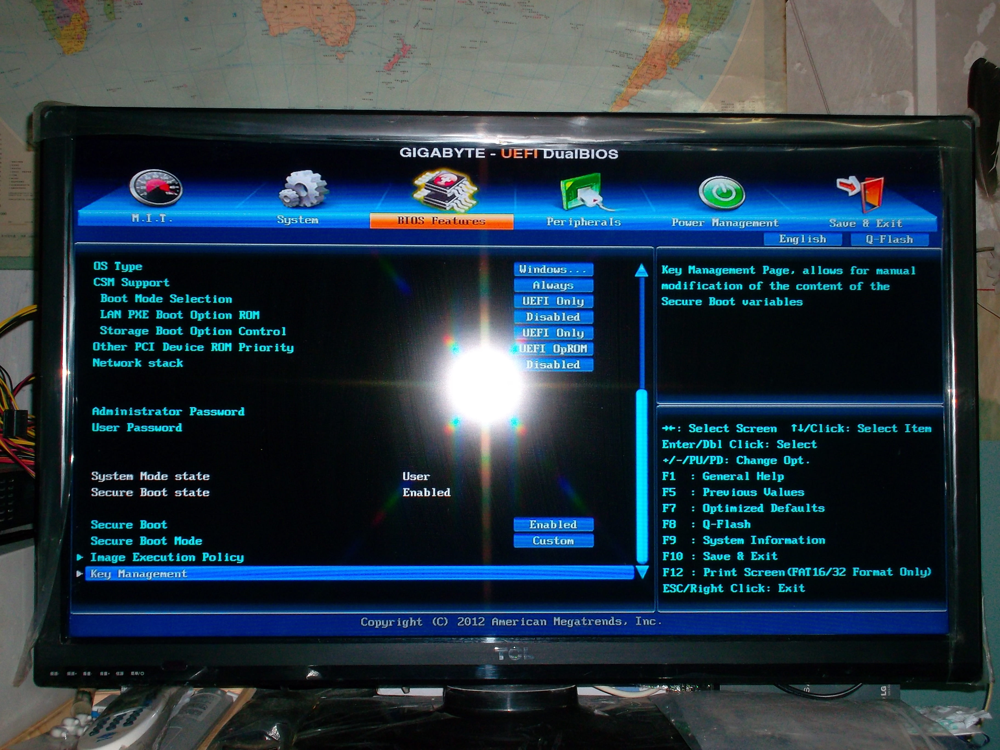
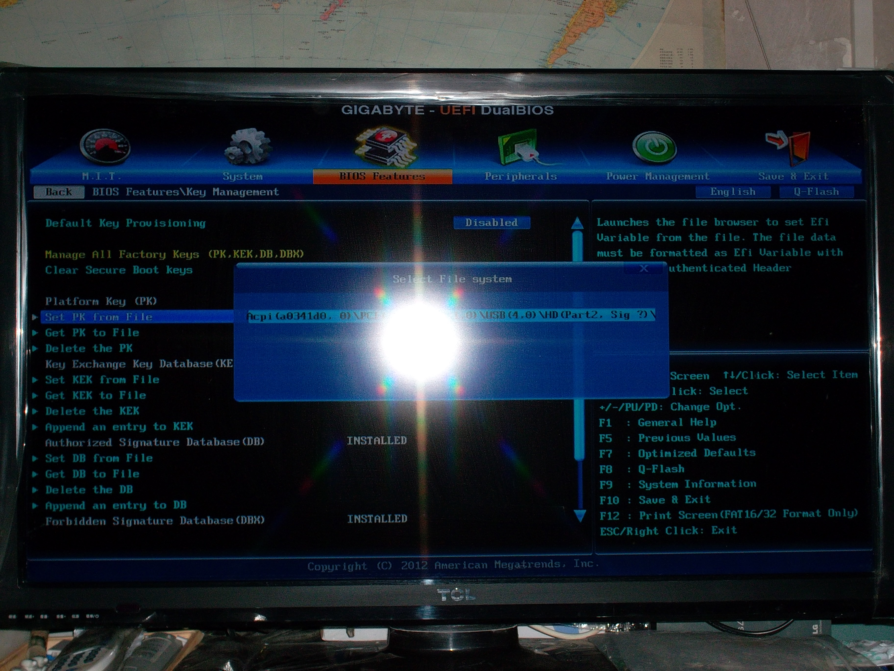
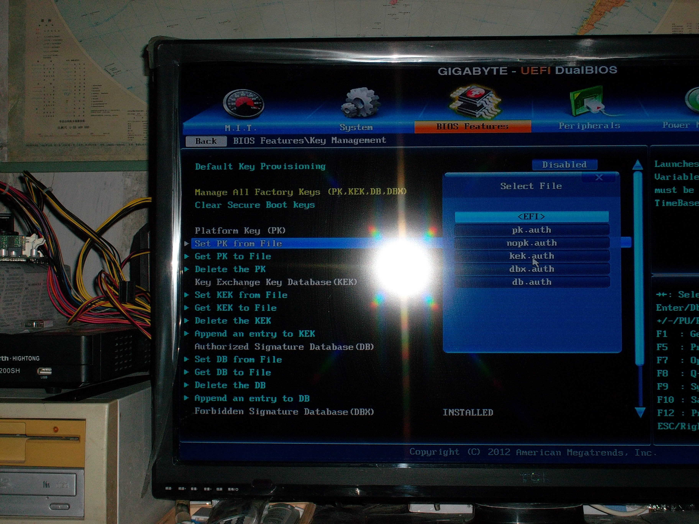
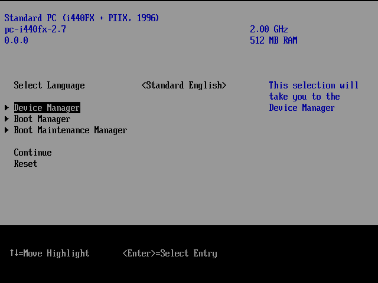
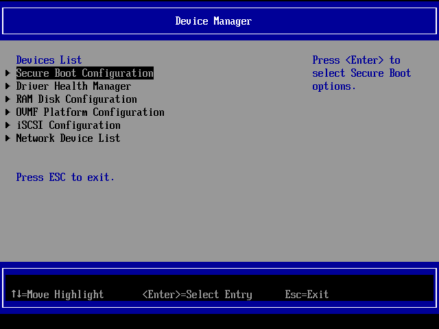
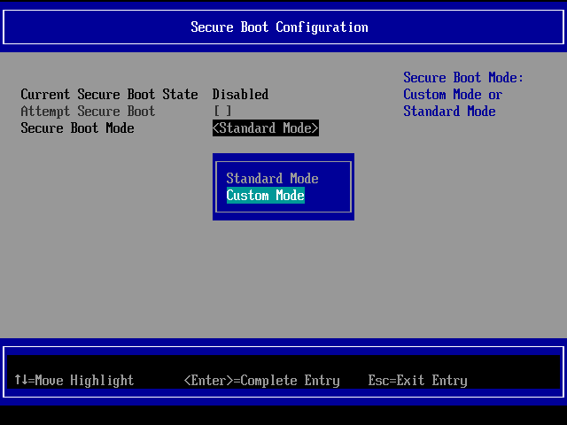
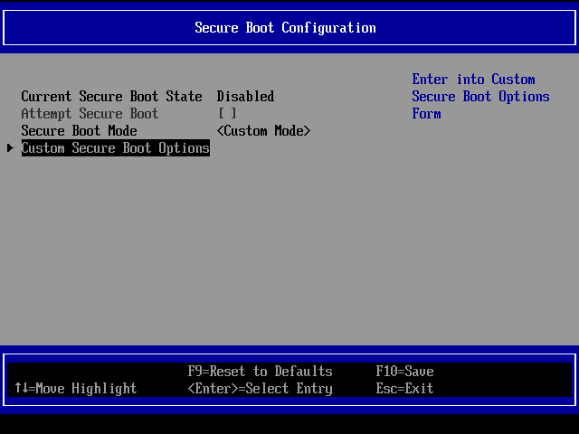
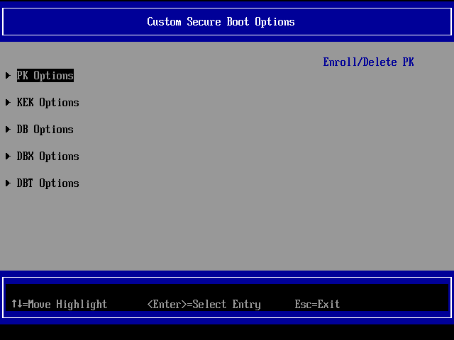

## Set Up Unrestricted Secure Boot On supporting machine
##### Copyright (c) TYA
##### Homepage: http://tya.company/

##### Background

Assuming that you have [made all needed preparations for secure boot on the key management server](./preparation-for-secureboot-on-km-server.md), now you can set secure boot up on machines with unrestricted uefi(i.e. it is possible to replace vendor-provided certificate for secure boot
with your own ones.)

For the two scenes below, it is assumed that there has been a Debian GNU/Linux installation booted via UEFI on the disk of the machine.

##### Deploy secureboot on physical machines

`dd` your efiboot.img to a usb flash drive (e.g. `/dev/sdc`):

```
# dd if=efiboot.img of=/dev/sdc
```

Plug the drive into one of the USB port of your physical machine, power the machine on, then go to the "BIOS" setting interface by pressing the corresponding hotkeys for the motherboard(I will use my GA-B75M-D3H board as an example.).

If the motherboard does support secure boot, there should be an option to set it to custom mode and manage the keys, like the picture below, otherwise, the motherboard either lacks such support or is locked down to Microsoft's keys. I have no plan to provide support for the latter, as least for now. 



Step into the `Key Management` interface, and use `Set ${KEY} from File` to browse and select key files on the USB drive.





Use the procedure above to set PK, KEK, DB, and DBX from file. With `System Mode state` changed to `User`, only EFI executables signed by DB keys could be executable.

Keep secure boot disabled/deactivated for now, as it should be enabled after boot scheme is set.

##### Deploy secure boot on VM booted by OVMF

Upload `efiboot.img` to the host within which your target VM running.

```
$ virsh -c ${HOST_URL} vol-create-as default efiboot 0
$ virsh -c ${HOST_URL} vol-upload --pool default --vol efiboot --file efiboot.img
```

Add a new (S)ATA storage pointing to to the newly uploaded disk image.

Boot the VM to the EFI shell.

Under EFI shell, type `FSn:\EFI\BOOT\KeyTool.efi` to execute the KeyTool.

KeyTool itself has a curses-like user interface, in which the keys (PK, KEK, db, dbx, etc) for this firmware could be manipulated.

To import keys to a platform, select `Edit Keys` first, then a key variable, then `Add New Key`, now you are able to browse the file system on the efiboot image, to add an .auth file to the key variable.

PK should be imported AFTER KEK, db, and dbx, because once PK is imported, the secure boot is enabled, and only signed efi executables could be executed. If at this time there is no valid trustchain inside the firmware, you will not be able to invoke any efi executable.

PK could only be replaced or deleted, not able to be added. Select `PK`, then `Replace Key(s)`, then you can browse the .auth file you want to use.

An .auth file generated from an empty .esl file and signed with PK (`nopk.auth` in the Makefile) could be used to delete PK. Select the PK, then select the existing key expressed with its UUID, and `Delete with .auth File`, then you can browse the file to delete PK. Other keys could be delete directly.

If the nopk file is invalid or the trustchain is broken that no efi executable can be executed, you could enter the config interface of the firmware by pressing ESC when TianoCore's logo appears on the screen. Select `Device Manager`, then `Secure Boot Configuration`, then change `Secure Boot Mode` to `Custom Mode`, you can now delete present keys on the `Custom Secure Boot Options` appeared below. Note: after PK is delete, the secureboot is disabled, and `Secure Boot Mode` is changed back to `Standard Mode`, so you should enable `Custom Mode` again in order to remove remaining keys.







Keep secure boot disabled/deactivated for now, as it should be enabled after boot scheme is set.


##### Boot Scheme

First, install the signed kernel to the operating system and make sure it is bootable via the grub installed by the package manager.

Copy signed boot loaders to the appropriate place, and register SHIM (`BOOTX64.EFI`) as a boot option (assuming the EFI system partition is at `/dev/sdXY`).

```
# mkdir -p /boot/efi/EFI/BOOT
# cp BOOTX64.EFI grubx64.efi /boot/efi/EFI/BOOT
# efibootmgr --create --disk /dev/sdX --part Y --loader /EFI/BOOT/BOOTX64.EFI --label "Default Loader"
```

After that secure boot could be enabled in the firmware configuration interface, and the signed grub is able to parse `/boot/grub/grub.cfg`, but now the grub is still able to load unsigned kernels with `linux` command, so `linuxefi` should be used instead.

Patch `/etc/grub.d/10_linux` with [this patch](../scripts/secureboot/10_linux.diff), then regenerate the `/boot/grub/grub.cfg`.

```
# patch /etc/grub.d/10_linux 10_linux.diff
# update-grub
```

After reboot, this target system will only load signed kernels BY DEFAULT, for `linux` module remains available inside the standalone grub. You can choose to modify the grub module list to exclude `linux` module in order to load signed kernel only, or to harden the os-installed grub config file, leaving `linux` module as a fallback mechanism only available to administrators.

###### References:
######[1] [Ways to build your own trustchain for secureboot.](./build-secureboot-trustchain.md)
######[2] [Use GRUB with Secure Boot](./grub-with-secure-boot.md), [This Makefile](../scripts/coreboot/grub.mk)
######[3] [Preparation for Secureboot on key management server](./preparation-for-secureboot-on-km-server.md)
